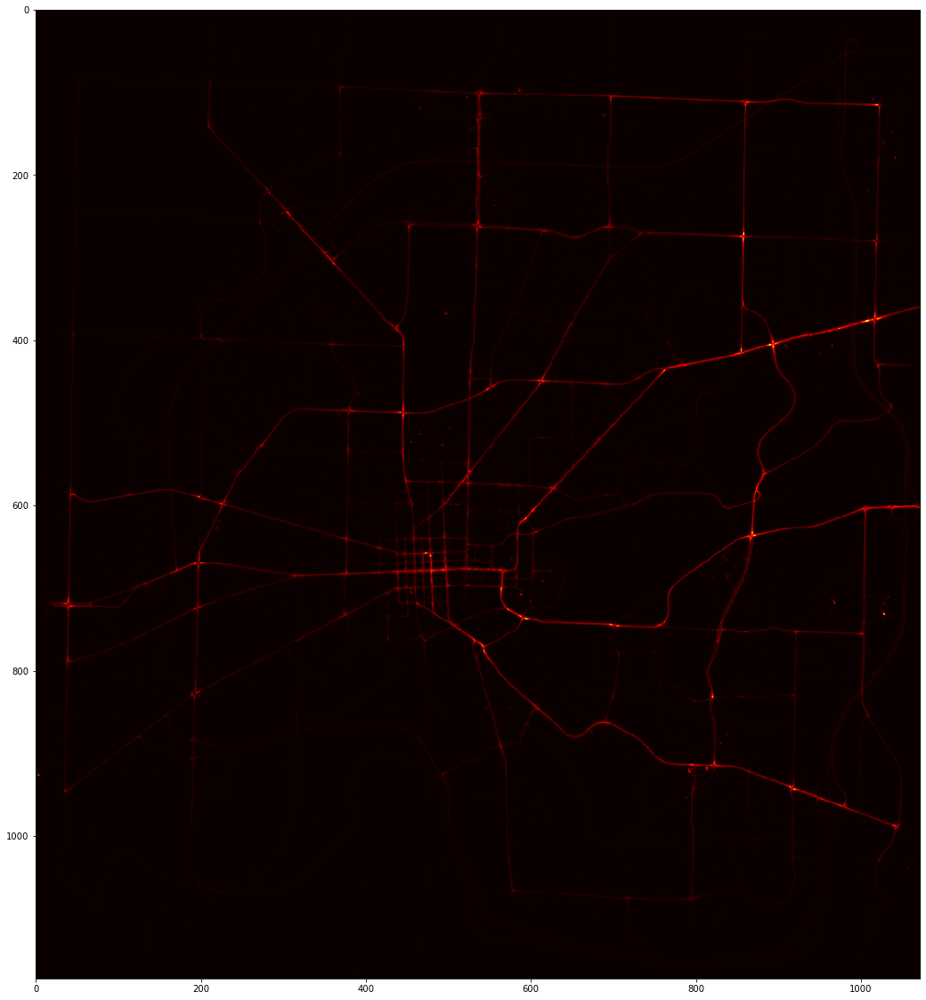

# DAT295

## Data process
### The original data
We use the original data from [VED](URL 'https://github.com/gsoh/VED'). There are 54 csv documents.

### First procession

Since the data inclue the latitude and longitude information, we load 54 csv document one by one and record the max and the min latitude, longitude per document. And then we get the max and the min values of all latitude and longitude.

Since this is a small area, we think of it as a square instead of a sphere. Then we use the formula to calculate the distance of the min_max latitude and min_max longitude.

$$haversin ({{d} \over {R}}) = haversin(\psi_1 - \psi_2) + cos(\psi_1)cos(\psi_2)haversin(\Delta \lambda)  $$

We get the distance from latitude is 11730.47m,the longitude is 10729.04m. And then set the precision in unit meter. Through distance, precision, min_max_latitude, min_max_longitude, we get the latitude difference and longitude difference per precision. Then we can generate the edge of latitude_longitude, which can help us to get the number of the record in the square. 

The brighter part means more data recorded.

When the precision is 10 meters:

- The number of block is 1257456.
- The number of block larger than 100 is 52968.
- The number of block larger than 1000 is 2140.

